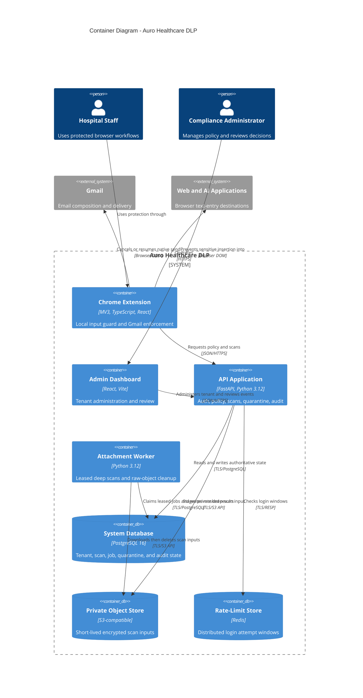

# Auro Container Architecture

```mermaid
C4Container
  title Container Diagram - Auro Healthcare DLP

  Person(staff, "Hospital Staff", "Uses protected browser workflows")
  Person(admin, "Compliance Administrator", "Manages policy and reviews decisions")
  System_Ext(gmail, "Gmail", "Email composition and delivery")
  System_Ext(webApps, "Web and AI Applications", "Browser text-entry destinations")

  System_Boundary(auro, "Auro Healthcare DLP") {
    Container(extension, "Chrome Extension", "MV3, TypeScript, React", "Local input guard and Gmail enforcement")
    Container(dashboard, "Admin Dashboard", "React, Vite", "Tenant administration and review")
    Container(api, "API Application", "FastAPI, Python 3.12", "Auth, policy, scans, quarantine, audit")
    Container(worker, "Attachment Worker", "Python 3.12", "Leased deep scans and raw-object cleanup")
    ContainerDb(postgres, "System Database", "PostgreSQL 16", "Tenant, scan, job, quarantine, and audit state")
    ContainerDb(objects, "Private Object Store", "S3-compatible", "Short-lived encrypted scan inputs")
    ContainerDb(redis, "Rate-Limit Store", "Redis", "Distributed login attempt windows")
  }

  Rel(staff, extension, "Uses protection through")
  Rel(admin, dashboard, "Operates", "HTTPS")
  Rel(extension, webApps, "Prevents sensitive insertion into", "Browser DOM")
  Rel(extension, gmail, "Cancels or resumes native send", "Browser DOM")
  Rel(extension, api, "Requests policy and scans", "JSON/HTTPS")
  Rel(dashboard, api, "Administers tenant and reviews events", "JSON/HTTPS")
  Rel(api, postgres, "Reads and writes authoritative state", "TLS/PostgreSQL")
  Rel(api, objects, "Stages private deep-scan input", "TLS/S3 API")
  Rel(api, redis, "Checks login windows", "TLS/RESP")
  Rel(worker, postgres, "Claims leased jobs and writes masked results", "TLS/PostgreSQL")
  Rel(worker, objects, "Downloads then deletes scan inputs", "TLS/S3 API")

  UpdateLayoutConfig($c4ShapeInRow="3", $c4BoundaryInRow="1")
```

The detection package is bundled into the API and worker; it is a library, not an independently
deployed container.
