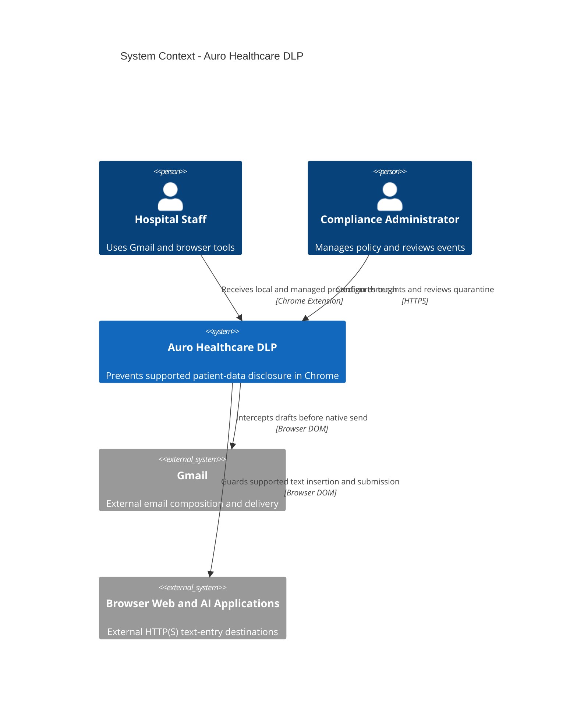

# Auro System Context

The Auro boundary includes the extension, dashboard, API, worker, and controlled data stores.
Gmail and other websites remain external systems whose internals Auro does not control.
