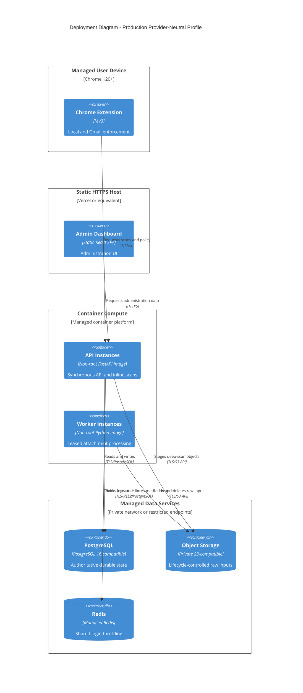

# Auro Production Deployment

The worker needs a continuously runnable process. The dashboard can be static-hosted, but the
worker must not be reduced to a request-only serverless function. Database, object storage, and
Redis endpoints should be private or restricted to the compute environment.
