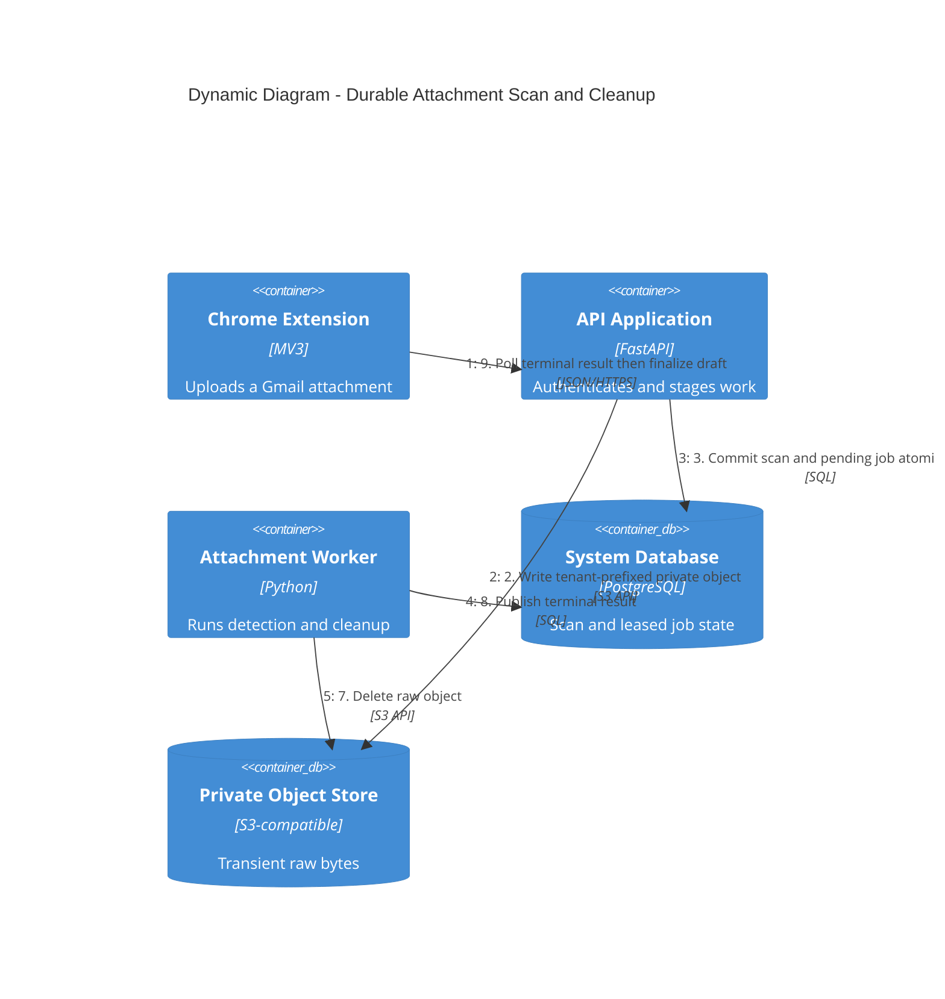

# Durable Attachment Scan Flow

If step 3 fails, the API deletes the staged object. If steps 4–8 fail, the PostgreSQL lease and
retry state preserve the work. Terminal status is withheld until step 7 succeeds.
