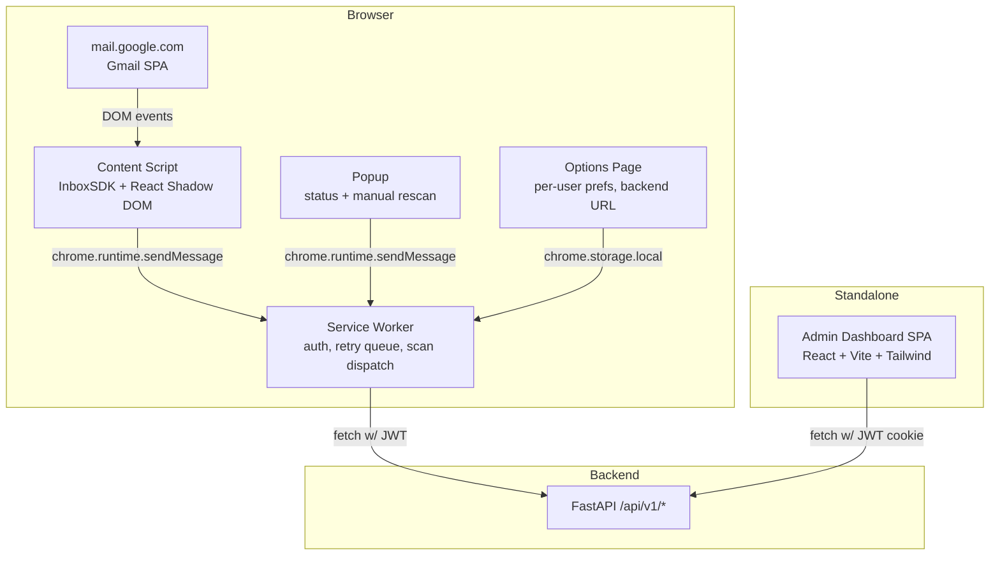

# Auro DLP v2 Frontend Build Plan

> Scope: Chrome Extension (MV3) that intercepts Gmail compose, talks to the FastAPI backend, and surfaces warning / block / quarantine flows. Plus the standalone **Admin Dashboard SPA** consumed by analysts and workspace admins.
>
> Audience: implementers. This document is plans-only — no scaffolding yet.

---

## 1. Goals & Non-Goals

### Goals
1. Intercept **every** Gmail Send path (popout, inline reply, fullscreen, mobile-on-desktop) **before** the message leaves the browser.
2. Capture **email body + subject + recipients + attachments (as raw `File`)** and hand them to the backend within the PRD latency budget (`<2 s` for text, `<10 s` with attachments).
3. Render a **warning / block / quarantine modal** in a style that fits Gmail but is style-isolated from Gmail's CSS.
4. Operate cleanly under **MV3** constraints (no remote code, transient service worker, restricted scopes).
5. Ship a **separate React SPA** for the admin dashboard (audit search, quarantine queue, policy editor, domain manager).
6. Be **enterprise-deployable** — force-installable via `ExtensionInstallForcelist`, configurable via `chrome.storage.managed`.

### Non-Goals (v1)
- iOS / Android Gmail apps (out of scope per PRD).
- Outlook / Yahoo Mail support.
- Drive scanning, secure-link replacement, email encryption (PRD future scope).
- Real-time collaboration in the dashboard.

---

## 2. Surface Architecture



Two independently deployed UI artifacts:
- **`extension/`** — Chrome MV3 extension (zipped & uploaded to CWS / Workspace Marketplace).
- **`dashboard/`** — Static React SPA built with Vite, served by Nginx behind the same domain as the API (e.g. `admin.aurodlpv2.io`).

---

## 3. Repository Layout

```
frontend/
├── extension/
│   ├── manifest.json                # MV3
│   ├── vite.config.ts               # Vite + @crxjs/vite-plugin
│   ├── tsconfig.json
│   ├── tailwind.config.ts
│   ├── postcss.config.cjs
│   ├── public/
│   │   └── icons/                   # 16/32/48/128 + monochrome toolbar
│   ├── src/
│   │   ├── background/
│   │   │   ├── index.ts             # SW entry; wakes on event, registers handlers
│   │   │   ├── auth.ts              # chrome.identity flow → backend session exchange
│   │   │   ├── api-client.ts        # fetch wrapper w/ JWT, retry, backoff
│   │   │   ├── retry-queue.ts       # Workbox-style BackgroundSync queue
│   │   │   └── messaging.ts         # typed onMessage router
│   │   ├── content/
│   │   │   ├── index.ts             # entrypoint; loads InboxSDK & mounts host
│   │   │   ├── inboxsdk-bridge.ts   # composeView discovery + presending hook
│   │   │   ├── attachment-tap.ts    # drop/change capture-phase listeners
│   │   │   ├── recipient-extractor.ts
│   │   │   ├── body-extractor.ts    # serialises HTML body + plain text
│   │   │   └── react-host/
│   │   │       ├── mount.tsx        # Shadow DOM host + createRoot
│   │   │       ├── tailwind.css?inline
│   │   │       └── components/
│   │   │           ├── ScanModal.tsx
│   │   │           ├── ScanProgress.tsx
│   │   │           ├── WarningBanner.tsx
│   │   │           ├── BlockedDialog.tsx
│   │   │           ├── QuarantineDialog.tsx
│   │   │           ├── EntityChip.tsx
│   │   │           └── RecipientPill.tsx
│   │   ├── popup/
│   │   │   ├── index.html
│   │   │   └── Popup.tsx            # status, last scan, link to dashboard
│   │   ├── options/
│   │   │   ├── index.html
│   │   │   └── Options.tsx          # backend URL, default action, scan toggle
│   │   ├── shared/
│   │   │   ├── types/               # ScanRequest, ScanVerdict, Entity, Policy
│   │   │   ├── api-schemas.ts       # zod schemas mirroring backend OpenAPI
│   │   │   ├── constants.ts
│   │   │   ├── feature-flags.ts     # remote config keys
│   │   │   └── telemetry.ts         # opt-in usage events
│   │   └── styles/
│   │       └── globals.css
│   ├── tests/
│   │   ├── unit/                    # Vitest
│   │   ├── e2e/                     # Playwright + persistent context
│   │   └── fixtures/                # offline Gmail-like HTML mock
│   └── tools/
│       ├── build-cws-zip.ts         # bundles ext for Chrome Web Store
│       └── bundle-analyzer.ts       # rollup-plugin-visualizer report
│
└── dashboard/
    ├── vite.config.ts
    ├── tsconfig.json
    ├── tailwind.config.ts
    ├── index.html
    ├── src/
    │   ├── main.tsx
    │   ├── app/
    │   │   ├── router.tsx           # React Router v6.4 data routes
    │   │   ├── providers.tsx        # QueryClient, Auth, Theme, Toast
    │   │   └── layout/
    │   │       ├── Shell.tsx
    │   │       ├── Sidebar.tsx
    │   │       └── TopBar.tsx
    │   ├── features/
    │   │   ├── auth/                # Google SSO landing, JWT cookie session
    │   │   ├── dashboard/           # stats cards, trend chart, top violations
    │   │   ├── audit-log/           # virtualised table, filters, CSV export
    │   │   ├── quarantine/          # queue, detail drawer, release/reject
    │   │   ├── policies/            # rule editor, dry-run, version history
    │   │   ├── domains/             # internal/partner/blocked lists
    │   │   ├── users/               # role mgmt, force-install status
    │   │   └── settings/            # workspace config, retention, scopes
    │   ├── shared/
    │   │   ├── api/                 # @tanstack/react-query hooks
    │   │   ├── components/          # shadcn/ui re-exports
    │   │   ├── hooks/
    │   │   ├── lib/                 # utils, formatters
    │   │   └── types/
    │   └── styles/
    └── tests/
        ├── unit/                    # Vitest + Testing Library
        └── e2e/                     # Playwright against staging API
```

---

## 4. Tech Stack Decisions

| Concern | Choice | Rationale |
|---|---|---|
| Build tool | **Vite 8** + `@crxjs/vite-plugin` for ext, Vite for SPA | Native MV3 support, fast HMR, code splitting, manualChunks |
| Language | **TypeScript 5.6 strict** | Type safety across content / SW / SPA / shared schemas |
| Framework | **React 19** | Concurrent rendering, smaller bundles after compiler |
| Gmail integration | **`@inboxsdk/core`** (npm, MV3 compatible) | `presending` event with `event.cancel()`; Streak maintains within hours of Gmail DOM churn |
| Styling | **Tailwind v3** + Shadow DOM | v4 has constructable-sheet issues across shadow boundaries; stay on v3 until WXT-#1585 is closed |
| Style isolation | `attachShadow({ mode: 'closed' })` + `adoptedStyleSheets` | Bi-directional CSS isolation from Gmail |
| State (extension) | React `useState` + `useReducer` + small context | No need for Zustand/Redux in MV3 content scope |
| State (SPA) | **TanStack Query v5** + minimal Zustand for UI flags | Server-state caching, optimistic mutations, SSE subscription |
| UI primitives (SPA) | **shadcn/ui** (Radix) + lucide-react | Accessible, headless, matches design system flexibility |
| Routing (SPA) | **React Router v6.4 data routers** | Loader/action pattern, code-split routes |
| Schema validation | **Zod 3** | Shared between extension & SPA via `frontend/shared` package |
| Forms | **react-hook-form + zod resolver** | Smaller and faster than Formik |
| Charts | **Recharts** (or **Tremor**) | SSR-friendly, tree-shakeable, sufficient for DLP analytics |
| Tables | **TanStack Table v8** + virtual rows | Audit log can hit 100k rows; need virtualisation |
| Tests | **Vitest** (unit) + **Playwright** (e2e) | Vitest matches Vite; Playwright is the 2026 standard for extensions |
| Lint/format | **ESLint v9 flat config** + **Prettier 3** | Standard |
| Pkg mgr | **pnpm 9 + workspaces** | Shared `shared/` package between extension & dashboard |
| Bundle budget | Ext content script **<250 KB gz**; SW **<80 KB gz**; SPA initial **<350 KB gz** | Enforced via `size-limit` in CI |

**Explicitly rejected:**
- `gmail.js` — requires page-context injection, jQuery dep, poor MV3 story.
- Raw `MutationObserver` re-implementation — Gmail DOM changes weekly; rebuilding InboxSDK in-house is anti-ROI.
- Tailwind v4 in extension — known constructable-sheet propagation bug across shadow roots.
- Next.js for dashboard — SSR is unnecessary; static Vite SPA behind Nginx is simpler and cheaper.
- Puppeteer — Playwright has first-class extension support and richer fixtures.

---

## 5. Manifest V3 Definition

```jsonc
{
  "manifest_version": 3,
  "name": "Auro DLP v2",
  "version": "0.1.0",
  "description": "Healthcare DLP for Gmail — blocks PHI leaks before Send.",
  "minimum_chrome_version": "120",

  "permissions": [
    "storage",
    "identity",
    "alarms",
    "scripting"
  ],
  "host_permissions": [
    "https://mail.google.com/*",
    "https://api.aurodlpv2.io/*"
  ],
  "optional_host_permissions": [
    "https://*.aurodlpv2.io/*"
  ],

  "background": {
    "service_worker": "src/background/index.ts",
    "type": "module"
  },

  "content_scripts": [{
    "matches": ["https://mail.google.com/*"],
    "js": ["src/content/index.ts"],
    "run_at": "document_idle",
    "all_frames": false
  }],

  "action": {
    "default_popup": "src/popup/index.html",
    "default_icon": { "16": "icons/16.png", "32": "icons/32.png" }
  },

  "options_ui": {
    "page": "src/options/index.html",
    "open_in_tab": true
  },

  "oauth2": {
    "client_id": "<<GCP_OAUTH_CLIENT_ID>>.apps.googleusercontent.com",
    "scopes": ["openid", "email", "profile"]
  },

  "icons": { "16": "icons/16.png", "32": "icons/32.png", "48": "icons/48.png", "128": "icons/128.png" },

  "content_security_policy": {
    "extension_pages": "script-src 'self'; object-src 'self'"
  },

  "externally_connectable": {
    "matches": ["https://admin.aurodlpv2.io/*"]
  },

  "storage": {
    "managed_schema": "managed-schema.json"
  }
}
```

Key constraints encoded:
- **No** `gmail.readonly` / `gmail.modify` scopes — `openid email profile` is enough because content extraction happens client-side. This **avoids the annual third-party security assessment** (US$15–75 K).
- `host_permissions` are narrow — `mail.google.com` + our API only. `optional_host_permissions` for staging.
- `externally_connectable` only the admin dashboard origin can `sendMessage` into the SW (used for "open extension diagnostics from dashboard").
- `managed-schema.json` exposes admin-controlled keys (backend URL, default action, telemetry opt-in) via `chrome.storage.managed`.

---

## 6. Gmail Compose Interception

### 6.1 InboxSDK bootstrap (content script)

```typescript
// content/inboxsdk-bridge.ts
import * as InboxSDK from '@inboxsdk/core';
import { handleCompose } from './compose-controller';

const APP_ID = 'sdk-aurodlpv2-prod';

void InboxSDK.load(2, APP_ID).then(sdk => {
  sdk.Compose.registerComposeViewHandler(handleCompose);
});
```

### 6.2 Per-compose state machine

```
       ┌──────────────┐
       │   IDLE       │  user typing
       └──────┬───────┘
              │ presending
              ▼
       ┌──────────────┐ event.cancel(); start scan
       │  SCANNING    │──────────────────────────────┐
       └──────┬───────┘                              │
              │ verdict                              │ user clicks "Edit"
              ▼                                      ▼
   ┌──────────────────┐                       ┌───────────┐
   │  CLEAN  →  send  │                       │  ABORTED  │
   └──────────────────┘                       └───────────┘
              │
              │ verdict.action
              ▼
   ┌──────────┬───────────┬────────────┐
   │  WARN    │  BLOCK    │ QUARANTINE │
   └──────────┴───────────┴────────────┘
```

### 6.3 Compose controller pattern

```typescript
// content/compose-controller.ts
import type { ComposeView } from '@inboxsdk/core';
import { extractEmail, extractAttachments } from './extractors';
import { renderModal } from './react-host/mount';
import { requestScan, finalizeScan } from '../background/messaging-client';

const enum State { IDLE, SCANNING, VERDICT, ABORTED }

export function handleCompose(view: ComposeView) {
  let state: State = State.IDLE;
  let forceSendToken: string | null = null;

  view.on('presending', async (event) => {
    if (state === State.VERDICT && forceSendToken) {
      // User confirmed override or quarantine release approved — let Gmail send.
      return;
    }
    event.cancel();          // <— stops Gmail from sending
    state = State.SCANNING;

    const payload = extractEmail(view);
    const files = await extractAttachments(view);   // see §7
    const { unmount, updateProgress } = renderModal(view, { state, payload });

    try {
      const verdict = await requestScan(payload, files, updateProgress);
      state = State.VERDICT;
      const decision = await renderModal(view, { state, verdict });
      // decision is one of: 'send', 'edit', 'request-release'
      if (decision === 'send' || decision === 'release-approved') {
        forceSendToken = verdict.scanId;
        await finalizeScan(verdict.scanId, decision);
        // Re-trigger Gmail's native send asynchronously to avoid presending loop.
        setTimeout(() => view.send(), 0);
      } else if (decision === 'edit') {
        state = State.ABORTED;
      }
    } catch (err) {
      // backend outage path — see §10
      const decision = await renderModal(view, { state: State.VERDICT, error: err });
      // ...
    } finally {
      unmount();
    }
  });

  view.on('destroy', () => {
    state = State.ABORTED;
  });
}
```

**Critical:** never call `view.send()` synchronously inside `presending` — it re-enters and loops. Use `setTimeout(..., 0)` plus a `forceSendToken` guard.

### 6.4 Discovery: extract recipients, subject, body

- `view.getToRecipients() / getCcRecipients() / getBccRecipients()` returns `{ name, emailAddress }[]`.
- `view.getSubject()` and `view.getHTMLContent()` give the typed content.
- Plain text fallback: parse the HTML with a tiny `<template>`-based extractor in the content script to avoid pulling in `html-to-text`.
- Quoted-reply detection: walk DOM and slice at the first `blockquote.gmail_quote` to avoid double-scanning previous thread content.

---

## 7. Attachment Capture (Critical Path)

### 7.1 Hard reality
Gmail uploads attachments to `https://mail-attachment.uploader.google.com/` the moment the user drops/selects them, leaving only an attachment-ID reference in the DOM. By Send time the original `File` is gone. We must therefore intercept the moment **before** Gmail's handler runs.

### 7.2 Tap drop + file-input change at capture phase

```typescript
// content/attachment-tap.ts
const capturedFiles = new WeakMap<HTMLElement, File[]>();

function bindCompose(host: HTMLElement) {
  host.addEventListener('drop', onDrop, true /* capture */);
  host.addEventListener('change', onChange, true);
}

function onDrop(e: DragEvent) {
  const compose = (e.target as HTMLElement)?.closest('[role="dialog"]');
  if (!compose) return;
  const files = Array.from(e.dataTransfer?.files ?? []);
  if (files.length) push(compose, files);
}

function onChange(e: Event) {
  const t = e.target as HTMLInputElement;
  if (t.type !== 'file' || !t.closest('[role="dialog"]')) return;
  push(t.closest('[role="dialog"]') as HTMLElement, Array.from(t.files ?? []));
}

function push(compose: HTMLElement, files: File[]) {
  const prev = capturedFiles.get(compose) ?? [];
  capturedFiles.set(compose, [...prev, ...files]);
}

export function takeFiles(compose: HTMLElement): File[] {
  const f = capturedFiles.get(compose) ?? [];
  capturedFiles.delete(compose);
  return f;
}
```

### 7.3 At Send time

1. Use InboxSDK to find the compose root `view.getElement()`.
2. Call `takeFiles(view.getElement())` → get original `File[]`.
3. Cross-reference with `view.getFileAttachmentCardViews()` (InboxSDK API) to make sure the file count matches. If counts diverge (e.g. user uploaded a file we never saw), prompt to re-add or fall back to **deny by default**.
4. Each `File` is converted to `Blob` and streamed via `FormData` to the SW, then to backend `/api/v1/scan/attachment` (multipart). See backend.md §6.

### 7.4 Tap registration lifecycle

- InboxSDK's `Compose.registerComposeViewHandler` fires once per open compose. Bind taps inside the handler; cleanup in `destroy`.
- Gmail recycles compose DOM nodes; rely on `WeakMap<HTMLElement, ...>` so old entries get GC'd.

### 7.5 Hard edge cases (call out in tests)

| Scenario | Behaviour |
|---|---|
| User adds attachment from Drive ("Insert files using Drive") | We **cannot** capture the file — it's a link. Detect via DOM attributes, scan link target via backend Drive integration (future scope). For v1, surface a non-blocking notice. |
| User pastes inline image (clipboard paste in body) | Listen for `paste` event with `clipboardData.files`. Treat as inline attachment. |
| Compose pre-populated with attachments (e.g. Forward) | InboxSDK `view.getFileAttachmentCardViews()` returns descriptors only. We fall back to scanning the original message via backend Gmail API integration (v1.1) or warn user. |
| Attachment removed by user after capture | `view.on('attachmentRemoved')` — drop from `capturedFiles`. |
| Files > 25 MB Gmail limit | Gmail switches to Drive; treat as Drive case above. |

---

## 8. React Modal in Shadow DOM (Style Isolation)

### 8.1 Mount

```typescript
// content/react-host/mount.tsx
import { createRoot } from 'react-dom/client';
import twCss from './tailwind.css?inline';

const HOST_ID = 'aurodlpv2-host';

export function ensureHost(): ShadowRoot {
  let host = document.getElementById(HOST_ID);
  if (!host) {
    host = document.createElement('div');
    host.id = HOST_ID;
    host.style.cssText = `position:fixed; inset:0; pointer-events:none; z-index:2147483647;`;
    document.body.appendChild(host);
  }
  let shadow = (host as HTMLElement & { _shadow?: ShadowRoot })._shadow;
  if (!shadow) {
    shadow = host.attachShadow({ mode: 'closed' });
    const sheet = new CSSStyleSheet();
    sheet.replaceSync(twCss);
    shadow.adoptedStyleSheets = [sheet];
    (host as any)._shadow = shadow;
  }
  return shadow;
}

export function renderModal(view: ComposeView, props: ModalProps) {
  const shadow = ensureHost();
  const mount = document.createElement('div');
  mount.style.pointerEvents = 'auto';
  shadow.appendChild(mount);
  const root = createRoot(mount);
  let resolve!: (d: Decision) => void;
  const promise = new Promise<Decision>(r => (resolve = r));
  root.render(<ScanModal {...props} onDecision={resolve} />);
  return {
    unmount: () => { root.unmount(); mount.remove(); },
    decision: promise,
    updateProgress: (p: Progress) => { /* re-render via reducer */ },
  };
}
```

### 8.2 Tailwind specifics

- **Tailwind v3** with `corePlugins: { preflight: false }` so we don't reset Gmail.
- Build Tailwind into a single string via `?inline` import; this becomes the constructable stylesheet.
- Use `rem`-free utilities or run `postcss-rem-to-px` so host font-size changes don't affect us.
- Namespace any custom classes with `ms-` prefix.

### 8.3 Z-index & focus

- Host `z-index: 2147483647` (max int) keeps us above Gmail's compose chrome.
- Modal must trap focus (`@radix-ui/react-dialog`) and restore focus on close.
- ESC closes modal but does **not** allow send — defaults to "edit".

### 8.4 Accessibility & i18n

- All copy via `react-intl` (default `en-IN`, scaffolded for `hi-IN` future).
- WCAG 2.2 AA: ≥4.5:1 contrast, full keyboard nav, `aria-live="assertive"` for verdict banner.
- Risk severities mapped to colour **plus** icon **plus** text (never colour alone).

### 8.5 Component inventory

| Component | Purpose |
|---|---|
| `ScanProgress` | Indeterminate progress for text scan + per-attachment progress bars |
| `EntityChip` | Masked entity badge (e.g. `Aadhaar ••••5678`) with hover for offset context |
| `RecipientPill` | Email + recipient class badge (Internal / Partner / External / Public / Unknown) |
| `WarningBanner` | Yellow, requires explicit confirm to send |
| `BlockedDialog` | Red, no send option, only "Edit" |
| `QuarantineDialog` | Orange, "Request release from admin", with justification textarea |
| `OfflineBanner` | Backend unreachable; per fail-closed policy, blocks send |
| `OverrideAuditNotice` | Reminder that override is logged with user identity |

### 8.6 Performance budget

- Modal first paint **<150 ms** from `presending`.
- Lazy-load heavy panels (entity detail drawer) via `React.lazy`.
- Memoise `EntityChip` list with `useMemo` keyed by `verdict.scanId`.

---

## 9. Service Worker (Background)

### 9.1 Constraints recap (MV3)
- Worker is terminated after 30 s idle; max 5 min per request.
- No module-scope mutable state — persist to `chrome.storage`.
- Use `chrome.alarms`, never `setInterval`.

### 9.2 Responsibilities

1. **Auth** — `chrome.identity.getAuthToken({ interactive })` → POST `id_token` to `/api/v1/auth/google/exchange` → receive short-lived JWT (15 min) + refresh cookie (handled automatically by browser for `api.aurodlpv2.io`).
2. **API client** — typed fetch with:
   - Auto-retry on `401` (refresh JWT), `429` (backoff), `5xx` (exponential backoff + jitter, up to 3 attempts).
   - Per-request `AbortController` exposed to content script for cancel-on-modal-close.
3. **Retry queue** — failed scans are pushed into `chrome.storage.local.scanQueue` and replayed on `chrome.alarms` `every 1m`. Each item has `{ id, payloadHash, attempts, nextAt }`. After 24 h we drop and surface in popup.
4. **Message router** — typed `chrome.runtime.onMessage` switch (`SCAN_REQUEST`, `FINALIZE_SCAN`, `GET_AUTH_STATUS`, `OPEN_DASHBOARD`).
5. **Managed config** — read `chrome.storage.managed` on `onInstalled` and `onStartup`; cache merged config in `chrome.storage.local`.
6. **Telemetry** — opt-in only; batch send to backend `/api/v1/telemetry`.

### 9.3 Failure modes & UX

| Failure | Detection | UX |
|---|---|---|
| User offline | `navigator.onLine` + fetch throws | **Fail-closed** modal: block send, show "Reconnect & retry" |
| Backend 5xx | HTTP status | Same as offline; offer "Send anyway (audited override)" only if `policy.allow_offline_override == true` |
| Backend slow (>10 s text, >30 s attach) | `AbortController` timeout | Cancel, treat as 5xx |
| Auth refresh fails | 401 after refresh | Force re-auth via popup |
| Quota exceeded (workspace plan) | 402 response | Block send + show admin contact |

### 9.4 Why fail-closed by default

PRD success metric is ">90 % PHI leak reduction" — allowing sends on backend outage breaks that guarantee. Admins can flip `allow_offline_override` via `chrome.storage.managed` for low-risk groups.

---

## 10. Admin Dashboard SPA

### 10.1 Auth

- Same Google SSO as extension. Dashboard origin (`admin.aurodlpv2.io`) gets the JWT in an HttpOnly secure cookie (set by backend `/api/v1/auth/google/exchange?source=dashboard`).
- Role-based access: `user` (no access), `analyst` (read audit + quarantine review), `admin` (policies + domains + users), `super_admin` (workspace settings + billing).

### 10.2 Information architecture

```
/
├── /dashboard        — KPI cards, daily trend, top violations (default)
├── /audit            — virtualised table, filters, drawer w/ entity timeline
├── /quarantine
│   ├── /pending
│   ├── /released
│   └── /:id          — detail with original masked payload, decision panel
├── /policies
│   ├── /              — list, last-modified, enabled toggle
│   ├── /new
│   ├── /:id/edit     — visual rule builder + raw JSON view + dry-run
│   └── /:id/history
├── /domains          — internal / partner / blocked / unknown tabs
├── /users            — invite, role change, force-install status
├── /settings
│   ├── /workspace
│   ├── /retention
│   ├── /integrations  — Slack/PagerDuty webhooks
│   └── /api-keys
└── /sign-in
```

### 10.3 Data flow

- **TanStack Query** for all server reads; mutations use `useMutation` with optimistic updates where safe.
- Long-running streams (live quarantine queue, live scan throughput) use **EventSource (SSE)** wrapped in a `useEventSource` hook with auto-reconnect.
- All API calls share a generated TS client from backend OpenAPI (`openapi-typescript` + `openapi-fetch`).

### 10.4 Critical pages — UX notes

| Page | Notes |
|---|---|
| Audit log | Cursor pagination (`occurred_at, id`); filter chips persist in URL; CSV export streams from backend; row click opens drawer with timeline, masked entities, policies hit, audit chain hash for verification. |
| Quarantine | Cards grouped by severity; bulk approve/reject; release triggers SSE event back to user's extension; each decision captures analyst justification (required by PRD audit log). |
| Policy editor | Visual builder for conditions (`entity.type == 'AADHAAR' AND recipient.class == 'PUBLIC_EMAIL'`); raw JSON tab; **dry-run** button replays the last 10 000 audit events and shows diff (would-block now / was-blocked). |
| Domain manager | Inline edit; bulk CSV import; live MX/SPF status from backend; explanation of how class is detected. |
| Settings → Retention | Sliders for audit (default 6 y), quarantine (7 d), telemetry (90 d). |

### 10.5 Visual style

- **shadcn/ui** baseline; custom `aurodlpv2` theme with brand teal `#0F8E7F` + neutral grays.
- Severity palette: low #16a34a, medium #ca8a04, high #ea580c, critical #b91c1c.
- Dark mode via `next-themes`-style toggle backed by `chrome.storage.local` so user prefs sync across surfaces (when extension is signed in).

---

## 11. Bundle Size & Performance Strategy

### Targets
- Content script `aurodlpv2-cs.js` **≤ 250 KB gz** including InboxSDK + React + modal.
- Service worker `aurodlpv2-sw.js` **≤ 80 KB gz**.
- SPA initial route **≤ 350 KB gz**; per-route chunks **≤ 120 KB gz**.

### Techniques
1. **Manual chunks** in Vite (`react-vendor`, `inboxsdk`, `icons`, `vendor`).
2. **Dynamic `import()`** in SW for rarely used modules (export utils, debug tooling).
3. **Tree-shake** lucide-react via per-icon imports.
4. **Avoid moment.js** → use `date-fns` per-function import.
5. **PostCSS purge** Tailwind on production build.
6. **`rollup-plugin-visualizer`** report uploaded as CI artifact every PR.
7. **`size-limit`** CI gate failing if any artifact exceeds budget.
8. **Async InboxSDK load**: dynamic-import on first compose detection, not on page load (saves ~70 KB on Gmail page idle).

---

## 12. Testing Strategy

### 12.1 Unit (Vitest + Testing Library)
- Pure functions: extractors, recipient classifier, masker, retry-queue reducer.
- React components: render + interaction with `@testing-library/react` inside JSDOM Shadow DOM polyfill.
- Schema round-trips against Zod.

### 12.2 Integration (Vitest + msw)
- Background message router: dispatched messages produce expected backend calls (mocked via `msw`).
- Retry queue: enqueue / drain / drop after 24 h.

### 12.3 End-to-end (Playwright + persistent context)
```typescript
const test = base.extend<{ context: BrowserContext; extensionId: string }>({
  context: async ({}, use) => {
    const ctx = await chromium.launchPersistentContext('', {
      channel: 'chromium',
      args: [
        `--disable-extensions-except=${EXT_DIST}`,
        `--load-extension=${EXT_DIST}`,
      ],
    });
    await use(ctx);
    await ctx.close();
  },
  extensionId: async ({ context }, use) => {
    const [sw] = context.serviceWorkers();
    const worker = sw ?? await context.waitForEvent('serviceworker');
    await use(worker.url().split('/')[2]);
  },
});
```

Scenarios:
1. Compose with Aadhaar in body → modal renders, send blocked, "Edit" returns user to compose.
2. Compose with PAN in PDF attachment → progress bar, verdict shows entity, masked.
3. Backend 503 → fail-closed modal; reconnect → resumes.
4. Quarantine release approved via dashboard → SSE event → extension shows "Approved" banner → user clicks send → mail leaves.
5. User override blocked unless `allow_offline_override == true`.

### 12.4 Visual regression
- **Playwright snapshots** for ScanModal, BlockedDialog, dashboard pages (`audit`, `quarantine`).
- Updated only via explicit PR review.

### 12.5 Gmail fixture for hermetic CI
- Static HTML fixture mimicking compose DOM, served by Playwright `fixture.html`, used for fast unit-level scan flows.
- Real Gmail account used in nightly e2e suite only (rotation key in CI secret manager).

### 12.6 Coverage gate
- Vitest **80 %** lines/branches on `extension/src/{background,content,shared}` and `dashboard/src/{features,shared}`.

---

## 13. Build, Release & Publish Pipeline

### 13.1 CI (GitHub Actions)
1. `lint` → ESLint + Prettier + tsc --noEmit.
2. `unit` → Vitest.
3. `build-ext` → `pnpm -F extension build` + `size-limit`.
4. `build-dash` → `pnpm -F dashboard build` + `size-limit`.
5. `e2e` → Playwright (parallel shards, persistent context).
6. `bundle-report` → upload visualizer html.
7. `package` (tags only) → `tools/build-cws-zip.ts` writes `aurodlpv2-ext-<sha>.zip`, sha-256 sum, source-map archive (private).

### 13.2 Chrome Web Store / Workspace Marketplace
- Two listings:
  - **Private Workspace listing** (default for v1 enterprise customers): published to the customer's Workspace domain only; deployed via admin console `ExtensionInstallForcelist` policy.
  - **Public CWS listing** (later): requires full review, restricted-scope security assessment if we ever add `gmail.readonly`.
- Privacy policy hosted at `https://aurodlpv2.io/privacy`; data-handling disclosure inside store listing.
- Use **Chrome Web Store Publish API** from CI to upload new versions; manual promote to production on tag `vX.Y.Z`.

### 13.3 Versioning
- SemVer; `manifest.version` and `package.json` kept in sync via `changesets`.
- Source maps uploaded to Sentry (extension origin), retained 90 days.

### 13.4 Force-install policy (admin config sample)
```jsonc
{
  "ExtensionInstallForcelist": [
    "<<EXT_ID>>;https://clients2.google.com/service/update2/crx"
  ],
  "ExtensionSettings": {
    "<<EXT_ID>>": {
      "installation_mode": "force_installed",
      "update_url": "https://clients2.google.com/service/update2/crx",
      "runtime_blocked_hosts": [],
      "runtime_allowed_hosts": ["mail.google.com"]
    }
  }
}
```

---

## 14. Security & Privacy

| Concern | Mitigation |
|---|---|
| Sensitive data on the wire | TLS 1.3 only; pin backend cert via SW (`fetch` with `expectedCertHash` check) for high-security customers. |
| Sensitive data at rest | Never persist email bodies in `chrome.storage`. Only scan IDs, last-verdict, masked entity summaries. |
| Token storage | JWT stored in `chrome.storage.session` (memory-only, cleared on browser close); refresh handled via HttpOnly cookie owned by backend. |
| XSS into Shadow DOM | All content rendered via React (no `dangerouslySetInnerHTML`); modal copy is static + interpolated literals only. |
| Clickjacking on dashboard | CSP `frame-ancestors 'none'`; `X-Frame-Options: DENY`. |
| Extension impersonation | `externally_connectable` limited to `admin.aurodlpv2.io`; messages signed with workspace key. |
| Telemetry leakage | Telemetry events are PII-free (event names + counts + durations); user can opt-out in Options. |
| Audit-log tamper claims | Dashboard exposes per-row hash so analysts can verify chain via backend `/api/v1/audit/verify`. |
| User override of block | Always logged with user identity + justification; admin-configurable allowlist of policies eligible for override. |

---

## 15. Build Phases (Implementation Order)

> Day estimates assume one senior FE engineer + one part-time designer. Adjust before scaffolding.

| Phase | Deliverable | Est. |
|---|---|---|
| **P0 — Scaffolding** | pnpm workspace, Vite ext + dashboard, Tailwind, ESLint, Vitest, Playwright skeleton, CI baseline. | 2 d |
| **P1 — MV3 skeleton + auth** | Manifest, SW boot, `chrome.identity` flow, backend exchange stub, popup w/ auth status. | 3 d |
| **P2 — Compose interception MVP** | InboxSDK bootstrap, `presending` hook, basic ScanModal in Shadow DOM, no real backend (mock verdict). | 4 d |
| **P3 — Body & recipient extraction** | Subject + body (HTML + text) + recipients with quoted-reply slicing; zod schemas. | 2 d |
| **P4 — Attachment capture** | `drop` + `change` + `paste` taps; cross-check with InboxSDK; multipart upload to SW → backend. | 4 d |
| **P5 — Real backend wiring** | Replace mock with `/api/v1/scan/*`; verdict-driven UI states (warn/block/quarantine); SSE for quarantine approval. | 3 d |
| **P6 — Retry queue + offline UX** | Workbox-style queue, `chrome.alarms`, fail-closed modal, override audit flow. | 3 d |
| **P7 — Options + managed config** | `chrome.storage.managed` schema, options page, force-install docs. | 2 d |
| **P8 — Dashboard shell + auth** | Vite SPA, router, shadcn/ui shell, Google SSO landing, role-gated routes. | 3 d |
| **P9 — Audit log + quarantine UI** | Virtualised table, filter chips, drawer, quarantine queue with bulk actions, SSE. | 5 d |
| **P10 — Policy editor + dry-run** | Visual builder, raw JSON tab, dry-run replay UI. | 5 d |
| **P11 — Domains, users, settings** | Domain manager, role mgmt, retention sliders, integrations. | 4 d |
| **P12 — i18n, a11y, visual regression** | react-intl, axe-core CI, Playwright snapshots. | 3 d |
| **P13 — Hardening & store prep** | Bundle-size gates, CSP review, privacy policy, store assets, private CWS upload, force-install policy docs. | 4 d |

**Total ≈ 47 dev-days** (~9.5 weeks for one engineer).

---

## 16. Risks & Mitigations

| Risk | Likelihood | Impact | Mitigation |
|---|---|---|---|
| Gmail DOM change breaks compose interception | Medium | High | Use InboxSDK (Streak fixes within hours); add monitoring SW pings `compose_handler_fired_total` and alerts on flat line |
| Attachment captured count ≠ Gmail count (Drive insert, paste corner cases) | High | High | Deny-by-default when counts diverge; surface explicit notice; track in metric `attachment_count_mismatch_total` |
| Tailwind v4 forced upgrade by deps | Low | Medium | Pin v3; track WXT-#1585; have spike branch ready for v4 migration |
| Service worker terminated mid-scan | High | Medium | All scan state persisted to `chrome.storage`; resume on next wake via retry queue |
| Restricted Google scopes requested in future versions | Medium | High | Stay on `openid email profile` for v1; document scope-review impact before adding `gmail.readonly` |
| Fail-closed modal annoys users on flaky networks | Medium | Medium | Per-policy `allow_offline_override`; admin telemetry on override rate |
| Bundle bloat from InboxSDK + React + Tailwind | Medium | Medium | size-limit CI gate; lazy-load InboxSDK + modal components |
| Dashboard exposed to public internet | Medium | Critical | SSO-only, CSP, frame-ancestors none, IP allowlist option for high-security customers |

---

## 17. Open Questions for SRS

`docs/srs.md` is currently empty. Before scaffolding the frontend we need:

1. **Compose modes supported on day 1** — popup only? popout? inline reply? full-screen? mobile-on-desktop?
2. **Multiple Gmail accounts in same Chrome profile** — must SW maintain per-account JWT, or is workspace-scoped enough?
3. **Default verdict action when backend is down** — fail-closed (block all) or fail-open with audit (allow + log)? PRD success metric implies fail-closed.
4. **Drive-attached files** — out of scope for v1, but do we need a hard block, soft warn, or silent log?
5. **Admin dashboard hosting** — same vendor domain (`admin.aurodlpv2.io`) for all tenants, or per-tenant subdomain (`<tenant>.aurodlpv2.io`)?
6. **Branding** — single Auro DLP v2 brand, or whitelabel per hospital network?
7. **Localisation** — English-only for v1, or Hindi at launch given Indian healthcare focus?
8. **Telemetry default** — opt-in or opt-out? (legal preference is opt-in for healthcare deployments.)
9. **User override of block** — allowed at all? If yes, which roles, which severities, with what justification UX?
10. **Compose-window throttling** — should we rate-limit how often the modal pops if user keeps clicking Send rapidly?

---

## 18. References

1. InboxSDK Compose API (presending / event.cancel): https://inboxsdk.github.io/inboxsdk-docs/compose/
2. InboxSDK MV3 NPM package: https://www.npmjs.com/package/@inboxsdk/core
3. InboxSDK GitHub: https://github.com/InboxSDK/InboxSDK
4. Chrome Service Worker lifecycle: https://developer.chrome.com/docs/extensions/develop/concepts/service-workers/lifecycle
5. Workbox BackgroundSync: https://developer.chrome.com/docs/workbox/modules/workbox-background-sync
6. Playwright Chrome Extension testing: https://playwright.dev/docs/chrome-extensions
7. CRXJS Vite plugin: https://crxjs.dev/vite-plugin
8. Chrome Web Store Enterprise publishing: https://developer.chrome.com/docs/webstore/cws-enterprise
9. Google Workspace Marketplace review: https://developers.google.com/workspace/marketplace/about-app-review
10. Shadow DOM + Tailwind isolation pattern: https://bgenc.com/2024.05.18.using-shadow-dom-to-isolate-injected-browser-extension-compo/
11. Tailwind v4 + Shadow DOM issue (WXT-#1585): https://github.com/wxt-dev/wxt/issues/1585
12. Gmail attachment upload protocol (reverse-engineering ref): https://webstandardssherpa.com/reviews/dissecting-gmails-email-attachments
13. shadcn/ui: https://ui.shadcn.com
14. TanStack Query v5: https://tanstack.com/query/v5
15. TanStack Table v8: https://tanstack.com/table/v8
16. phi-redactor (backend pattern reference): https://github.com/DilawarShafiq/phi-redactor
17. Trackio (compose-intercept OSS reference): https://github.com/ayushkcs/trackio
18. Strac Gmail DLP (commercial reference): https://www.strac.io/integration/gmail-dlp
19. Nightfall DLP for Browser (commercial reference): https://chromewebstore.google.com/detail/nightfall-dlp-for-browser/jgmgecncmjklkabkejnjfgfkglapfgek
